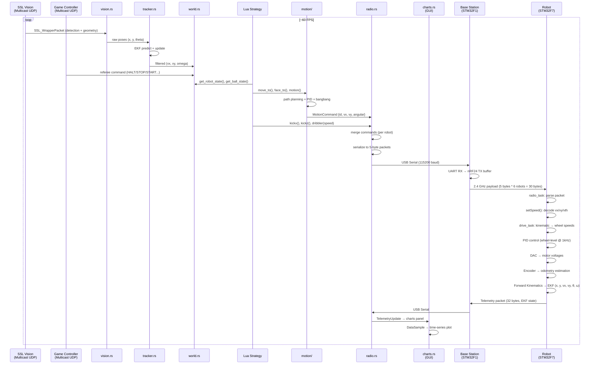
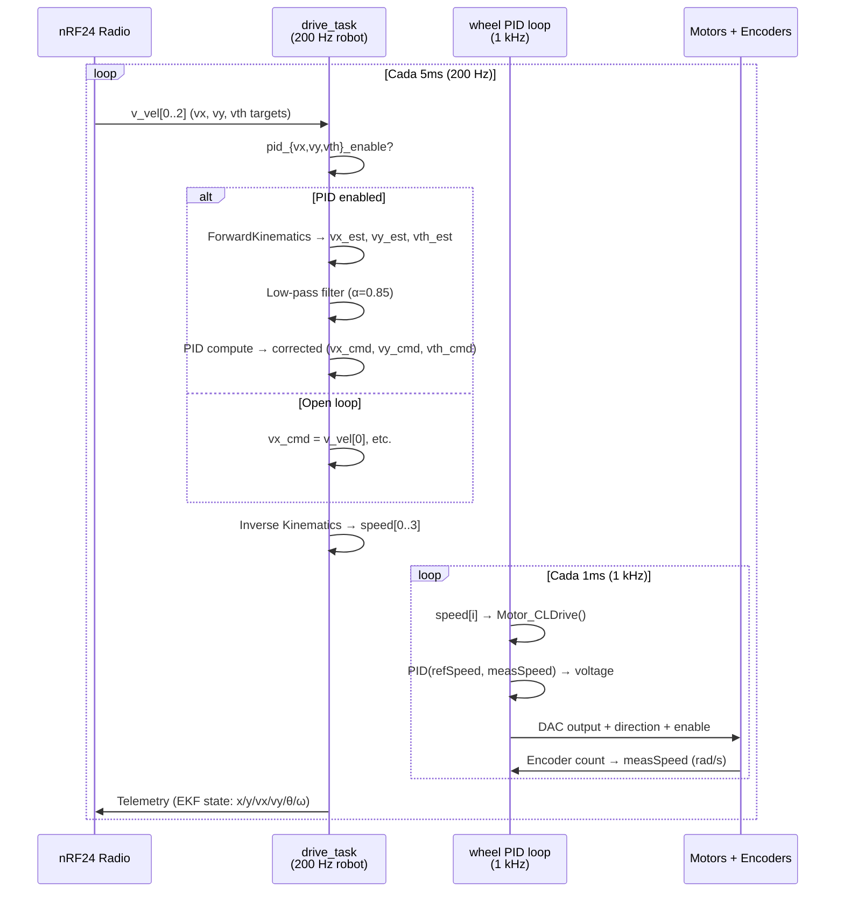

# Diagrama de Flujo de Datos

```mermaid
sequenceDiagram
    participant SSL as SSL Vision<br/>(Multicast UDP)
    participant GC as Game Controller<br/>(Multicast UDP)
    participant V as vision.rs
    participant T as tracker.rs
    participant W as world.rs
    participant L as Lua Strategy
    participant M as motion/
    participant R as radio.rs
    participant CH as charts.rs<br/>(GUI)
    participant BS as Base Station<br/>(STM32F1)
    participant RB as Robot<br/>(STM32F7)

    loop ~60 FPS
        SSL->>V: SSL_WrapperPacket (detection + geometry)
        V->>T: raw poses (x, y, theta)
        T->>T: EKF predict + update
        T->>W: filtered (vx, vy, omega)
        
        GC->>W: referee command (HALT/STOP/START...)
        
        L->>W: get_robot_state(), get_ball_state()
        L->>M: move_to(), face_to(), motion()
        M->>M: path planning + PID + bangbang
        M->>R: MotionCommand {id, vx, vy, angular}
        L->>R: kickx(), kickz(), dribbler(speed)
        
        R->>R: merge commands (per robot)
        R->>R: serialize to 5-byte packets
        R->>BS: USB Serial (115200 baud)
        
        BS->>BS: UART RX → nRF24 TX buffer
        BS->>RB: 2.4 GHz payload (5 bytes * 6 robots = 30 bytes)
        
        RB->>RB: radio_task: parse packet
        RB->>RB: setSpeed(): decode vx/vy/vth
        RB->>RB: drive_task: kinematic → wheel speeds
        RB->>RB: PID control (wheel-level @ 1kHz)
        RB->>RB: DAC → motor voltages
        RB->>RB: Encoder → odometry estimation
        RB->>RB: Forward Kinematics → EKF (x, y, vx, vy, θ, ω)
        
        RB->>BS: Telemetry packet (32 bytes, EKF state)
        BS->>R: USB Serial
        R->>CH: TelemetryUpdate → charts panel
        CH->>CH: DataSample → time-series plot
    end
```

## Ciclo de Control Anidado (Robot)

```mermaid
sequenceDiagram
    participant NRF as nRF24 Radio
    participant DT as drive_task<br/>(200 Hz robot)
    participant WL as wheel PID loop<br/>(1 kHz)
    participant MTR as Motors + Encoders

    loop Cada 5ms (200 Hz)
        NRF->>DT: v_vel[0..2] (vx, vy, vth targets)
        
        DT->>DT: pid_{vx,vy,vth}_enable?
        alt PID enabled
            DT->>DT: ForwardKinematics → vx_est, vy_est, vth_est
            DT->>DT: Low-pass filter (α=0.85)
            DT->>DT: PID compute → corrected (vx_cmd, vy_cmd, vth_cmd)
        else Open loop
            DT->>DT: vx_cmd = v_vel[0], etc.
        end
        
        DT->>DT: Inverse Kinematics → speed[0..3]
        
        loop Cada 1ms (1 kHz)
            WL->>WL: speed[i] → Motor_CLDrive()
            WL->>WL: PID(refSpeed, measSpeed) → voltage
            WL->>MTR: DAC output + direction + enable
            MTR->>WL: Encoder count → measSpeed (rad/s)
        end
        
        DT->>NRF: Telemetry (EKF state: x/y/vx/vy/θ/ω)
    end
```
